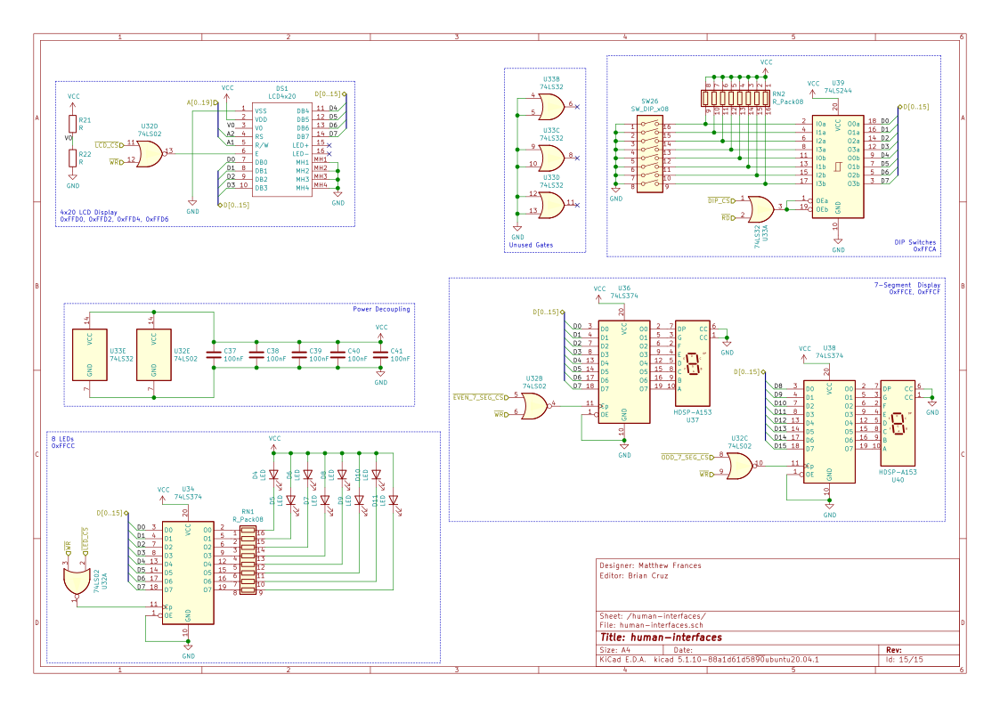

# 8086-system
8086-based system, designed in KiCAD

3D Render of PCB

PCB Overview (fill zones not shown)

Root Sheet

8086 Processor and Bus Demultiplexing Logic

28F010 CMOS Flash

CY7C199 SRAM

8284A Clock Generator

PAL16L8 I/O Address Decoding

8259 Interrupt Controller

8254 Counter

8279 Keyboard

16550 UART Interface

8255 Programmable Peripheral Interface 1

8255 Programmable Peripheral Interface 2

8255 Programmable Peripheral Interface 3

LCD, 7-Segment Displays, LEDs, DIP Switches

Bus Headers, Power Connections

Front Copper Layer

Inner Copper Layer 1

Inner Copper Layer 2

Back Copper Layer

This repository is for submission as the final project for Systems Design and Programming at the University of Maryland, Baltimore County under instruction of William Smith

Unauthorized copying of this project is considered a violation of university academic integrity policy